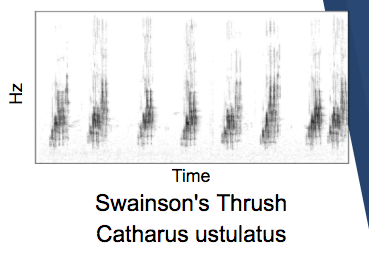

# Bird Classifier by Call or Song

It's widely agreed there are between 9,000-10,000 bird species. Some sources double that number (sources).

When outdoors a birder seems more likely to hear a bird than see it. This results in difficulty identifying bird species in rural and urban centers alike since we visual location can be difficult at times. However, by using a bird's call or song we can identify the species and decide if we wish pursue visual identification. If the sound can be used to classify a bird species, researchers and amateur birders alike can have a better idea of what species are present and ideally map their location.

Automated classification allows for hobbyists to easily retrieve information on the bird species heard. Additionally, automated recordings could be stored and compared to future sound events determining if species depopulation has occurred.

## Table of Contents

- [Overview Pipeline](#overview-data-flow)
- [Data Sources](#data-sources)
- [Data](#data)
- [Features](#features)
- [Convolutional Neural Network](#convolutional-neural-network)
- [Final Model Architectue](#final-model-architecture)
- [Results](#results)
- [Future Plans](#future-plans)
- [Acknowledgements](#acknowledgements)

## Overview Process Flow
The data was gathered from the [xeno-centro](http://www.xeno-canto.org/) website. 
40 top species determined and their landing pages scraped for obtaining mp3 urls. 
Mp3s audio scraped and stored on AWS S3 
[Librosa](https://librosa.github.io/librosa/index.html) used to transform the sound into a spectrogram. 
Processed spectrogram with CNN using [Keras](https://keras.io/) to classify bird song or calls.

## Data Sources
- http://www.xeno-canto.org/

## Data
- 40 classes of bird species.
- 33,567 separate audio files.
- 85G of audio data.
- Used 60/40% split data, all input images were 138 x 138 x 1 pixels
  - 20,156 training samples
  - 13,438 validation samples

## Features
A challenge with using sound is taking the input to a CNN is an image.

Visualizing sound can be done with a spectrogram. It's a 2 dimensional representation of sound. The horizontal axis is time, vertical axis is frequency (Hx) or pitch if you prefer. The darkness of a spot is the loudness of the sound in decibels.

Here is an example: 

Once spectrograms are the choice of input, deciding what features from the audio will be extracted and placed into the spectrogram was my next step.

After investigating several libraries to assist in audio feature sampling and extraction, I decided to use [librosa](https://librosa.github.io/librosa/index.html). It's well documented and is written in python so it works well with my project. The drawback was processing speed. It is slower than some of the other libraries out there due to it's entirely python architecture.

Now feature choices, I could take the low or percussive sounds, the high frequency spectrums, the  Mel-frequency cepstrum, or STSF.

STSF ([Short-time Fourier transform](https://en.wikipedia.org/wiki/Short-time_Fourier_transform)) was chosen because it yielded the best results on a well balanced test/validation set of around 1,000 samples in 5 classes. Accuracy of this baseline was 38%.

## Convolutional Neural Network

A multi layer CNN with PReLU activation and 1 Dense layer with 1 output sigmoid layer. 
Input was 138x138x1 grayscale spectrogram.

## Problems (maybe as separate or grouped topics)
Getting Data. I was able to scrape and then convert mp3 files to spectrograms.
After a bit of experimenting the STFT was found to give very good results.

Deciding with limited time how to preprocess for the best data to present to the models.

Now that the project is over and is just mine I wish to redo the preprocessing and see if I can get better results. It is my opinion that better results will happen if I change the preprocessing.

## Final Model Architecture

Final model was a CNN implemented with Keras arrived at after testing various  architectures and activation layers. The final activation leading to best results was PReLU. The overall keras CNN model summary is as follows:

|Layer (type)          |       Output Shape          | Param #|
|--------------------| :-----------------------------|:------|
|conv2d_1 (Conv2D)    |        (None, 136, 136, 32) |     320 |
|p_re_lu_1 (PReLU)     |       (None, 136, 136, 32)  |    591872
|conv2d_2 (Conv2D)     |       (None, 134, 134, 64)  |    18496
|p_re_lu_2 (PReLU)     |       (None, 134, 134, 64)  |    1149184
|max_pooling2d_1 (MaxPooling2) |(None, 67, 67, 64)   |     0
|p_re_lu_3 (PReLU)      |      (None, 67, 67, 64)    |    287296
|conv2d_3 (Conv2D)      |      (None, 65, 65, 128)   |    73856
|p_re_lu_4 (PReLU)      |      (None, 65, 65, 128)   |    540800
|max_pooling2d_2 (MaxPooling2)| (None, 32, 32, 128)  |     0
|p_re_lu_5 (PReLU)            |(None, 32, 32, 128)   |    131072
|dropout_1 (Dropout)          |(None, 32, 32, 128)   |    0
|conv2d_4 (Conv2D)            |(None, 30, 30, 128)   |    147584
|p_re_lu_6 (PReLU)            |(None, 30, 30, 128)   |    115200
|max_pooling2d_3 (MaxPooling2 |(None, 15, 15, 128)   |    0
|p_re_lu_7 (PReLU)            |(None, 15, 15, 128)    |   28800
|dropout_2 (Dropout)          |(None, 15, 15, 128)   |    0
|conv2d_5 (Conv2D)            |(None, 13, 13, 128)   |    147584
|p_re_lu_8 (PReLU)            |(None, 13, 13, 128)   |    21632
|max_pooling2d_4 (MaxPooling2 |(None, 6, 6, 128)     |    0
|p_re_lu_9 (PReLU)            |(None, 6, 6, 128)     |    4608
|dropout_3 (Dropout)          |(None, 6, 6, 128)     |    0
|conv2d_6 (Conv2D)            |(None, 4, 4, 128)     |    147584
|batch_normalization_1 (Batch |(None, 4, 4, 128)     |    512
|p_re_lu_10 (PReLU)           |(None, 4, 4, 128)      |   2048
|max_pooling2d_5 (MaxPooling2 |(None, 2, 2, 128)     |    0
|dropout_4 (Dropout)          |(None, 2, 2, 128)     |    0
|flatten_1 (Flatten)          |(None, 512)           |    0
|dense_1 (Dense)              |(None, 128)           |    65664
|p_re_lu_11 (PReLU)           |(None, 128)           |    128
|dropout_5 (Dropout)          |(None, 128)           |    0
|dense_2 (Dense)              |(None, 40)            |    5160
|activation_1 (Activation)    |(None, 40)            |    0

|                   |                |
|:-------------------|---------------:|
|Total params:| 3,479,400|
|Trainable params:|3,479,144|
|Non-trainable params: |256|

## Results

Using a sample set of 33,567
- 60/40% split of data, all input images were 138 x 138 x 1 pixels
  - 20,156 training samples
  - 13,438 validation samples

**Accuracy: 63.5%**

## Future Plans

* A website
* Smartphone app
* Free access to use and upload data adding to data store

## Acknowledgements
1. https://www.safaribooksonline.com/library/view/hands-on-machine-learning/9781491962282/ch11.html -- prelu diagram
2. https://www.allaboutbirds.org/guide/Barn_Swallow/id
3. https://eastsideaudubon.org/corvid-crier-stories-2014-12/bird-of-the-month-red-crossbill-loxia-curvirostra
4. https://www.amnh.org/about-the-museum/press-center/new-study-doubles-the-estimate-of-bird-species-in-the-world
5. http://kentorchards.org.uk/?wildlife=greater-spotted-woodpecker
6. https://www.allaboutbirds.org/guide/PHOTO/LARGE/fox_sparrow_garytyson.jpg
7. http://cdn.audubon.org/cdn/farfuture/lXuJTdJNEgTYmGhH73SLss1cbfWAN5A-h3XPET8YOzY/mtime:1422549944/sites/default/files/House_Sparrow_s52-12-123_l_1.jpg
8. https://www.allaboutbirds.org/guide/PHOTO/LARGE/barn_swallow_1.jpg
9. https://www.youtube.com/watch?v=PmMYVeE9QJw
10. https://www.youtube.com/watch?v=m1k3N0VaqGc
11. http://www.audubon.org/field-guide/bird/great-horned-owl
12. Presentation template by SlidesCarnival
13. http://www.singing-wings-aviary.com/wp-content/uploads/2015/02/European-Goldfinch-Photos.jpg
13. http://orientalbirdimages.org/images/data/lesser_whitethroat__0002562lr.jpg
15. http://www.whenlifeisgood.com/birding-by-ear-how-to-identify-birds-by-their-sounds/
